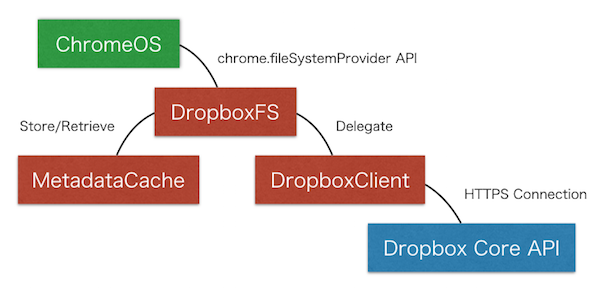

# Code Structure

This document describes you code structure of this software. Mainly, I write down about the directory structure and the purpose of each file.

# Directories

* **/** - Build files, Configuration files, and etc.
* [/src](../src) - This directory has one HTML file and the manifest.json file.
* [/src/_locales/en](../src/_locales/en) - There is one message resource file for English.
* [/src/icons](../src/icons) - This directory has some image files.
* [/src/scripts](../src/scripts) - There are some JavaScript files.
* [/src/styles](../src/styles) - There is one css style sheet definition file.
* [/docs](./) - Currently, there is one image file which is referenced by the README.md file.

At least, if you are a programmer, first you should enter the /app/scripts directory and see each JavaScript files to understand this app's behaviors.

# Files

## For Building

### [/gulpfile.js](../gulpfile.js)

This file defines all procedures to build this software with [gulp](https://gulpjs.com/).

### [/package.json](../package.json)

This file defines npm project information, building script commands and dependencies.

## HTML

### [/src/windows/mount_window.html](../src/windows/mount_window.html)

This is a HTML file for the screen which users see at first when this software is launched. For instance, this HTML file has one button to start mounting the Dropbox storage. The click event is handled by the function defined in the /src/scripts/mount_window.js file.

### [/src/windows/auth_window.html](../src/windows/auth_window.html)

This is an HTML file for the screen which shows users the Dropbox login page. It contains a `<webview>` which gets directed to the Dropbox auth URL. The script for this page is /src/scripts/auth_window.js. When Dropbox redirects back to the application, the redirect event is captured and the redirect URL is send in a message to /src/scripts/background.js.

## JavaScript

This software consists of some JavaScript files. The abstract structure is the following:

### [/src/scripts/base_window.js](../src/scripts/base_window.js)

The base_window.js file contains a base class for the MountWindow and AuthWindow classes. The constructor for this class sets the text content of all elements with a message id in their `data-message` attribute to the corresponding message text.  

### [/src/scripts/mount_window.js](../src/scripts/mount_window.js)

This mount_window.js file is in charge of handling each click event fired on the window.html. For instance, there are the events below:

* Mount button click event
* Setting button click event
* Opened files limit radio buttons change event

Each event handler is assigned by the assignEventHandlers() function.

#### Mount button click event

When this event fired, the onClickedBtnMount() function is called. The mount_window.js file doesn't have any process to mount the Dropbox. Instead, this event handler delegates the actual process to the background page represented by the background.js file. For instance, the onClickedBtnMount() function sends a message to the background page. The message has one key/value pair: type:"mount".

After sending the message to the background page, the function waits a response. If the response has a success flag, the function closes the window.

#### Setting button click event

When this event fired, the onClickedBtnSettings() function is called. This function opens the setting dialog.

#### Opened files limit radio buttons change event

When this event fired, the onChangedOpenedFilesLimit() function is called. In the function, the selected value is stored with the chrome.storage.local API.

#### Other

If a current date is on December, this script shows you a special image.

### [/src/scripts/auth_window.js](../src/scripts/auth_window.js)

This script handles the OAuth2 Implicit Grant flow in auth_window.html. The normal flow works as follows:

1. The background script opens the window with `chrome.app.window.create`.
2. The DOM is loaded, including a `<webview>` element. The webview has no `src` set yet.
3. The callback for `chrome.app.window.create` is called.
4. The `load` event fires for the window.
5. The webview displays the Dropbox login page.
6. The goes through the login process, causing events to fire on the webview
7. Dropbox redirects the user back to the app-supplied `redirectUrl` and includes the OAuth2 token.
8. The `loadredirect` event fires for the webview.

#### `chrome.app.window.create` callback

This callback is responsible for passing the `authUrl`, `redirectUrl`, `successCallback`, and `errorCallback` from the background script to the auth window.

#### Window load event 

When this event is fired, the handler creates a new `AuthWindow` object and calls it's `onLoad` method.

The `onLoad` method attaches event listeners to and sets the `src` attribute on the webview.

#### Load redirect event

When this event is fired, the onLoadRedirect() function is called. This function only pays attention to redirects at the top level of the webview. It stops the stall detection timer, then it checks if the target URL starts with `window.redirectUrl`. If so, then the user has finished logging in and Dropbox is redirecting back to the app. The redirectUrl is passed back to `window.successCallback` so that the token can be extracted, then all browsing data is cleared for the webview and the window is closed.

#### Load abort event

When this event is fired, the onLoadAbort() function is called. This function calls `event.preventDefault()` for every aborted load to suppress spurious application errors. If the abort happens at the top level then the functions starts the stall detection timer.

#### Load start event

When this event is fired, the onLoadStart() function is called. If the load is happening at the top level of the webview, then this function stops the stall detection timer.

#### Stall detection timer

There is no guaranteed way to detect that the login process has failed in the webview. Instead, a heuristic is used. If a load aborts within the webview at the top level and no new load is initiated within five seconds, it is assumed that the login has failed. In this case, an error is send back via `window.errorCallback`, the webview's browsing data is cleared, and the window closes.       

### [/src/scripts/background.js](../src/scripts/background.js)

This is a background page script. Mainly, this script has a responsibility of launching the window when users want to mount the Dropbox. Also, this script has an ability to receive the message from the mount_window.js script. When the message received, this script delegates the request of mounting the Dropbox to the [/src/scripts/dropbox_fs.js](../src/scripts/dropbox_fs.js) script. Especially, this script has one DropboxFS instance.

This script can know what users want to mount the Dropbox by handling [chrome.fileSystemProvider.onMountRequested](https://developer.chrome.com/extensions/fileSystemProvider#event-onMountRequested) event. When this event fired, this script opens the window.html.

### [/src/scripts/dropbox_fs.js](../src/scripts/dropbox_fs.js)

This script file is an implementation for [chrome.fileSystemProvider](https://developer.chrome.com/apps/fileSystemProvider) API. That is, this script has a responsibility of the following:

* When this script receives the request of mounting/unmounting, do mounting.mounting with the chrome.fileSystemProvider.mount()/unmount() API.
* Handling all events of the chrome.fileSystemProvider API. Each event has a name "on\***Requested", and this script has functions which has the same name of each event.
* Caching fetched meta data. For instance, Each meta data fetched is stored into [/src/scripts/metadata_cache.js](../src/scripts/metadata_cache.js). This script improves a performance using the cache mechanism.
* This software has an ability to mount multiple accounts of Dropbox at the same time. Each connection is represented by DropboxClient class defined in [/src/scripts/dropbox_client.js](../src/scripts/dropbox_client.js). This script manages multiple DropboxClient instances.

This script defines a DropboxFS class. The DropboxFS instance is created by the background.js. This script never communicate to Dropbox API server. Instead, this script delegates them to the dropbox_client.js script. That is, this script has a responsibility of handling FSP events and proxying them to the dropbox_client.js script.

* mount() - DropboxClient#authorize(), DropboxClient#getUserInfo()
* onReadDirectoryRequested() - DropboxClient#readDirectory()
* onGetMetadataRequested() - DropboxClient#getMetadata()
* onOpenFileRequested() - DropboxClient#openFile()
* onReadFileRequested() - DropboxClient#readFile()
* onCloseFileRequested() - DropboxClient#closeFile()
* onCreateDirectoryRequested() - DropboxClient#createDirectory()
* onDeleteEntryRequested() - DropboxClient#deleteEntry()
* onMoveEntryRequested() - DropboxClient#moveEntry()
* onCopyEntryRequested() - DropboxClient#copyEntry()
* onWriteFileRequested() - DropboxClient#writeFile()
* onTruncateRequested() - DropboxClient#truncate()
* onCreateFileRequested() - DropboxClient#createFile()

### [/src/scripts/dropbox_client.js](../src/scripts/dropbox_client.js)

This script provides an ability to communicate with Dropbox API server. That is, this script uses each Dropbox API to treat user's directories/files. For instance, [Dropbox API v2](https://www.dropbox.com/developers/documentation/http/overview) is used.

OAuth2 Implicit Grant flow is used to identify a user. The work of starting the auth flow and obtaining the token is delegated to `ChromeWebviewAuthStrategy` in [/src/scripts/auth_strategies.js](../src/scripts/auth_strategies.js).  

Basically, there are functions corresponding to each Dropbox API.

* authorize() - [/oauth2/authorize](https://www.dropbox.com/developers/documentation/http/documentation)
* unauthorize() - [/token/revoke](https://www.dropbox.com/developers/documentation/http/documentation#auth-token-revoke)
* getUserInfo() - [/users/get_current_account](https://www.dropbox.com/developers/documentation/http/documentation#users-get_current_account)
* getMetadata() - [/files/get_metadata](https://www.dropbox.com/developers/documentation/http/documentation#files-get_metadata)
* readDirectory() - [/files/list_folder](https://www.dropbox.com/developers/documentation/http/documentation#files-list_folder) [files/list_folder/continue](https://www.dropbox.com/developers/documentation/http/documentation#files-list_folder-continue)
* closeFile() - [/files/upload_session/finish](https://www.dropbox.com/developers/documentation/http/documentation#files-upload_session-finish)
* readFile() - [/files/download](https://www.dropbox.com/developers/documentation/http/documentation#files-download)
* createDirectory() - [/files/create_folder](https://www.dropbox.com/developers/documentation/http/documentation#files-create_folder)
* deleteEntry() - [/files/delete](https://www.dropbox.com/developers/documentation/http/documentation#files-delete)
* moveEntry() - [/files/move](https://www.dropbox.com/developers/documentation/http/documentation#files-move)
* copyEntry() - [/files/copy](https://www.dropbox.com/developers/documentation/http/documentation#files-copy)
* createFile() - [/files/upload](https://www.dropbox.com/developers/documentation/http/documentation#files-upload)
* writeFile() - [/files/upload_session/start](https://www.dropbox.com/developers/documentation/http/documentation#files-upload_session-start) [/files/upload_session/append_v2](https://www.dropbox.com/developers/documentation/http/documentation#files-upload_session-append_v2)
* truncate() - [/files/upload_session/start](https://www.dropbox.com/developers/documentation/http/documentation#files-upload_session-start) [/files/upload_session/append_v2](https://www.dropbox.com/developers/documentation/http/documentation#files-upload_session-append_v2) [/files/upload_session/finish](https://www.dropbox.com/developers/documentation/http/documentation#files-upload_session-finish) 

### [/src/scripts/metadata_cache.js](../src/scripts/metadata_cache.js)

This script provides an ability to keep metadata objects. As the result, whole performance is increased because of reducing a network communication. Each metadata object is stored per each directory. That is, the cache key is a directory path.

* put() - Store metadata object array to the cache storage mapped by the specified directory path.
* get() - Retrieve metadata object/array specified by the directory path/file path.
* remove() - Delete the metadata object/array specified by the directory path/file path.

## Other

### [/src/manifest.json](../src/manifest.json)

This is a manifest file which is needed for Chrome Apps.
